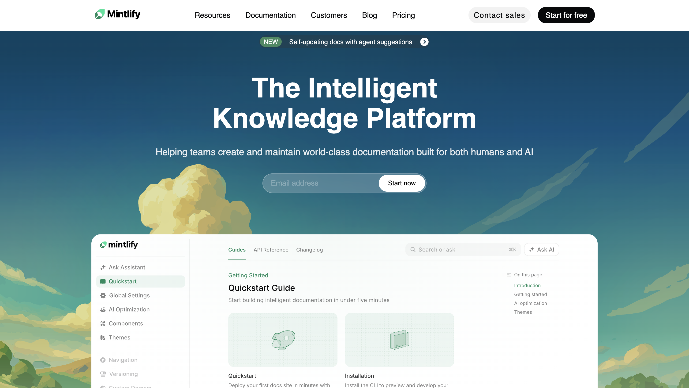

# Mintlify Clone

A static clone of the [Mintlify](https://mintlify.com) landing page built with HTML and CSS.

## 📸 Preview

Here's what the clone looks like:




## Overview

This project recreates the Mintlify documentation platform's landing page for practice and learning purposes.

## Tech Stack

- **HTML5** - Semantic markup
- **CSS3** - Styling and layout

## Project Structure

```
Mintlify/
├── index.html      # Main landing page
├── style.css       # Styles
├── Assets/         # Images and assets
└── README.md
```

## Getting Started

Open `index.html` in your browser to view the page.

## Features

- Responsive navigation
- Hero section with CTA
- Feature cards
- Enterprise section
- Customer stories
- Footer with links

## Sections Recreated

- **Navigation** - Sticky header with logo, links, and CTA buttons
- **Hero Section** - Main headline, subtitle, email signup, and product preview
- **Trusted Companies** - Company logos banner
- **Features Section** - "Built for the intelligence age" with feature cards
- **Enterprise Section** - Enterprise offerings with Anthropic case study
- **Customers Section** - Customer stories grid (Perplexity, X, Kalshi)
- **CTA Section** - Pricing and quickstart split cards
- **Footer** - Multi-column links, social icons, and theme toggle

## Fonts & Colors

### Font

- **Inter** (Variable font) - Primary typeface

### Colors

| Color           | Hex                     | Usage             |
| --------------- | ----------------------- | ----------------- |
| Primary         | `#08090b`               | Text, buttons     |
| Secondary       | `#ffffff`               | Backgrounds       |
| Mountain Meadow | `#18e299`               | Accent, labels    |
| Riptide         | `#3f8a62`               | CTA links, badges |
| Muted Text      | `rgba(62, 61, 61, 0.9)` | Secondary text    |
| Border          | `rgba(0, 0, 0, 0.08)`   | Card borders      |

